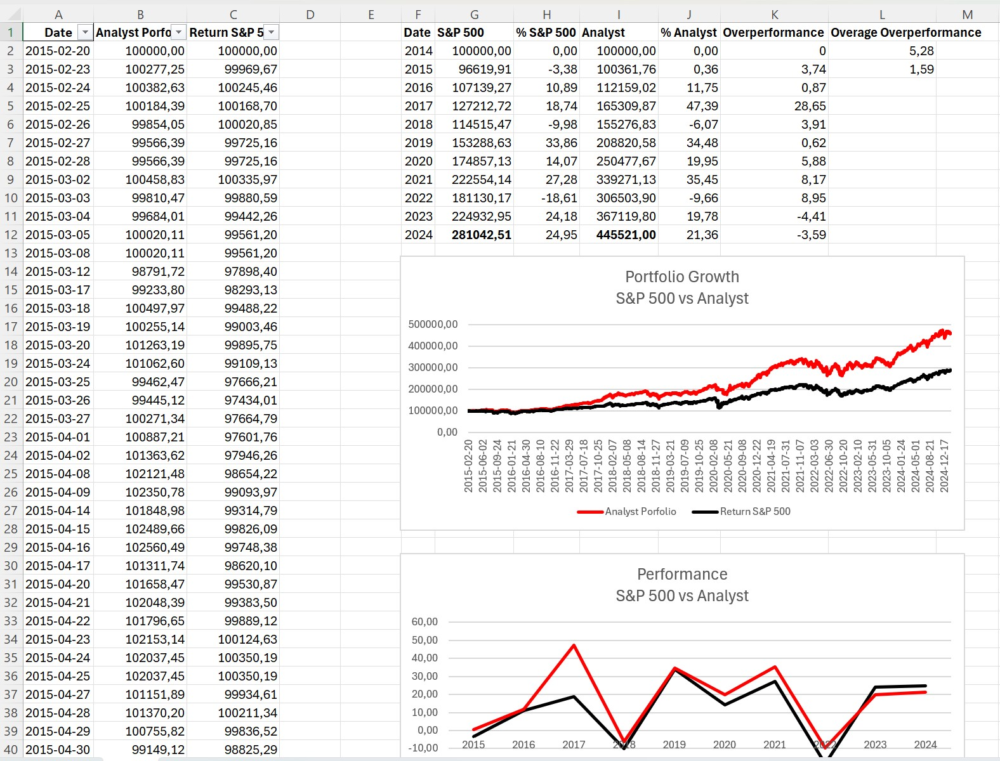
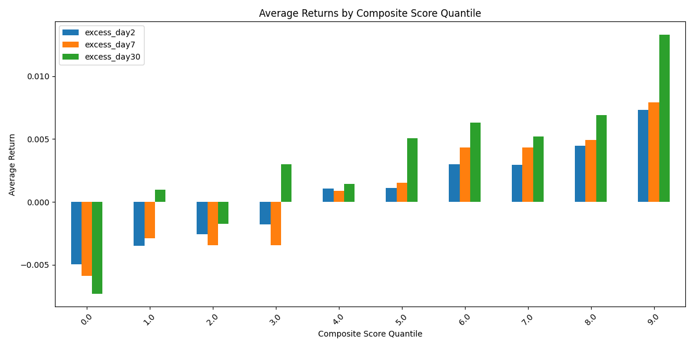

# Use AI to Predict Stock Performance and Outperform the S&P 500 by 5% Annually

Inspired by a research paper, I used GPT-3.5 to analyze all earning calls transcripts of the 500 largest stocks in the US over a 10 year period. 

The top 40 stocks with the highest score would grow my portfolio in the last decade by a **4.5 fold - from 100k to 445k.** Compared to the S&P 500 which only grew by a 2.8 fold - from 100k to 281k.



Based on the score I sorted the stocks into 10 buckets (quintiles) and performed a statistical analysis by looking at the stock performance 30 days after the earnings call.



[Monthly excess returns for days after the earnings call (day2, day7, day30).]

```
quantile    excess_day2  excess_day7   excess_day30

0.0         -0.004920    -0.005930     -0.007329
1.0         -0.003478    -0.002807      0.001034
2.0         -0.002609    -0.003537     -0.001818
3.0         -0.001842    -0.003764      0.002848
4.0          0.001055     0.001002      0.001408
5.0          0.001280     0.001642      0.005185
6.0          0.002990     0.004406      0.006496
7.0          0.002956     0.004300      0.005122
8.0          0.004426     0.004840      0.006800
9.0          0.007239     0.007788      0.013077
```

The highest quintile has an excess return of 1.33% per month whereas the lowest quintile has an excess return of -0.73% per month.

source:
- Research Paper: [Can ChatGPT Replicate Analyst Recommendations](https://papers.ssrn.com/sol3/papers.cfm?abstract_id=4819470)
- Joachim Klement: [ChatGPT can predict analyst forecast changes](https://klementoninvesting.substack.com/p/chatgpt-can-predict-analyst-forecast)


## Implementation Overview

**1. Data Collection:**
Download Stock Metadata, Transcripts and Prices from Financial Modeling Prep, e.g. Earnings Transcript API

**2. Processing and Scoring:**
Use ChatGPT prompts to summarize earnings calls transcripts and extract the AIS and calculate ΔAIS and SUE to form the composite score.

**3. Data Grouping and Exporting:**
Group data into snapshots and export all snapshots as one big JSON file for later analysis. (A snapshot is a collection of earnings calls results of all stocks at a given point in time. We create a snapshot for every date where an earnings call happened for any of the 500 companies.)

**4. Quantitative Analysis and Strategy Testing:**
Validate the stock performance by analyzing quantile-based returns and simulate practical investment strategies.

## Read More

To get a better overview about the the content of the case study please read my article "[Use AI to Predict Stock Performance and Outperform the S&P 500 by 5% Annually](TODO)" on Medium.com.

For more details please refer to the following documents:
* [Medium Article](doc/Medium.md)
* [personal Research](doc/Research.md)
* [Detailed Code Workflow](doc/Workflow.md)
* [Results of the Show Case](doc/Results.md)

## Disclaimer

This is a personal project and should not be taken as professional investment advice. Always conduct your own research or consult with a financial advisor.


---


# C# Application (src/FinancialAnalysis/)

A collection of tools for analyzing financial data, including stock trading simulations and market analysis.

The Financial Analysis application performs automated financial analysis on stock earnings calls and market data. The tool processes earnings call transcripts using Azure OpenAI to generate sentiment scores and combines them with financial metrics to provide comprehensive analysis.

## Features

- Fetches and analyzes S&P 500 constituents data
- Processes earnings call transcripts using Azure OpenAI
- Calculates various financial metrics including:
  - AI Sentiment Score (AIS)
  - Standardized Unexpected Earnings (SUE)
  - Price movements post-earnings
  - Percentile rankings
- Supports data caching for API responses
- Exports results to Excel and JSON formats
- Implements intelligent rate limiting for API calls

## Prerequisites

- .NET 8.0 or higher
- Azure OpenAI API access
- Financial Modeling Prep API key

## Configuration

Configure the application in `appsettings.json`:

```json
{
  "AppSettings": {
    "AzureOaiEndpoint": "your_azure_openai_endpoint",
    "AzureOaiKey": "your_azure_openai_key",
    "AzureOaiDeployment": "gpt-35-turbo",
    "FinancialModelingPrepKey": "your_fmp_api_key",
    "UseCache": true,
    "OnlyLatest": false,
    "START_DATE": "2015-01-01",
    "END_DATE": "2025-02-14",
    "NumberOfQuartersForEpsHistory": 8
  }
}
```

### Configuration Options

- `OnlyLatest`: Controls the analysis mode
  - `false`: Historical analysis mode - processes all earnings calls between START_DATE and END_DATE
  - `true`: Latest-only mode - processes only the most recent 4 months of earnings calls
  - Use `false` for backtesting and historical analysis
  - Use `true` for current market analysis and faster processing

## Project Structure

```
src/FinancialAnalysis/
├── App.cs                # Main application logic
├── Program.cs            # Entry point
├── Startup.cs            # DI and configuration setup
├── Configuration/        # Configuration classe (AppSettings.cs)
├── Model/                # Data models (EarningsCall.cs)
└── Content/              # System prompts and configuration files
    ├── system-message-transcript-summary.txt
    ├── system-message-detailed-scores.txt
    ├── system-message-naive-score.txt
    └── custom-order.json
```

## Key Components

### App.cs
The main application class that orchestrates:
- Fetching S&P 500 constituents
- Processing earnings call data
- Calculating financial metrics
- Managing API rate limits
- Generating output files

### Rate Limiting
Implements token bucket algorithm for API rate limiting:
- Azure OpenAI: 180 RPM (3 RPS)
- Financial Modeling Prep API: Configurable limits

### Caching
- HTTP responses cached to `cache/http/`*
- AI responses cached to `cache/ai/`*
- Improves performance and reduces API costs

**(`cache` folder will be located here `src\FinancialAnalysis\bin\Debug\net8.0\cache`)*

### Output Formats
1. JSON Snapshot (`out/snapshots.json`)*
   - Contains latest analysis results
   - Includes key metrics and scores

2. Excel Files
   - Latest Data (`out/earnings-data-latest.xlsx`)*
   - Historical Data (`out/earnings-data-history.xlsx`)*

**(`out` folder will be located here `src\FinancialAnalysis\bin\Debug\net8.0\out`)*

## Usage

1. Set up configuration in `appsettings.json`
2. Run the application:

```bash
cd src/FinancialAnalysis

dotnet run
```

## Output Metrics

The `snapshots.json` file contains calculated results from earnings calls with the following key metrics:
- `ais`: AI Sentiment Score
- `ais_delta`: Change in AIS from previous period
- `ais_naive`: Simple sentiment score
- `sue`: Standardized Unexpected Earnings
- Percentile rankings for all metrics
- `score`: Combined final score

## Rate Limiting Details

The application implements sophisticated rate limiting:
- Azure OpenAI: 3 requests/second with burst capacity of 10
- Semaphore-based concurrent request limiting
- Exponential backoff for retries
- Token bucket algorithm for smooth rate limiting

## Error Handling

- Robust retry mechanism for API calls
- Logging of all operations and errors
- Graceful degradation when services are unavailable


# Python Scripts (src/*.py)

## 1. Analysis Script (`src/analyse.py`)
Performs quantile analysis on stock data based on composite scores.
- Calculates returns for different time periods (2, 7, and 30 days)
- Computes excess returns compared to S&P 500
- Creates visualizations of returns by quantile
- Exports analysis results and charts

```bash
python analyse.py --snapshot-file path/to/snapshots.json
```

## 2. Trading Transactions (`src/get-trading-transactions.py`)
Simulates a trading strategy based on top-scoring stocks.
- Maintains a portfolio of top 40 stocks
- Tracks transactions and portfolio value
- Exports results to Excel files:
  - `analyst-trading-transactions.xlsx`
  - `analyst-portfolio-values.xlsx`

```bash
python get-trading-transactions.py --snapshot-file path/to/snapshots.json
```

## 3. S&P 500 Historical Values (`src/get-sp500-historical-values.py`)
Retrieves and processes S&P 500 historical data.
- Fetches prices for all snapshot dates in one request
- Handles missing data by using last known price
- Exports to `sp500-historical.xlsx`

```bash
python get-sp500-historical-values.py --snapshot-file path/to/snapshots.json
```


## License

MIT License