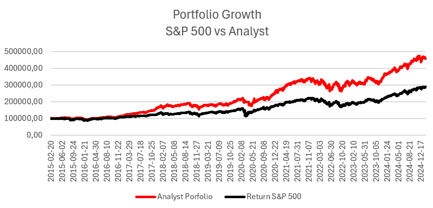

# Fun Facts

- stocks analyzed: **542**
- earnings calls analyzed: **20k**
- number of earning call dates: **2008**
- period that has been analyzed: **2015-02-20 - 2025-02-14**
- time it took to run: **120 hours (5 days)**
- ChatGPT cost: **100 EUR**
- financial API cost: **67 EUR**

# Setup

* use GPT-3.5 to analyse earning calls transcripts for S&P 500 stocks during a 10 year period (2015-02-20 - 2025-02-14)
* the "score" is a composite of AIS, AIS_delta, SUE

Original Paper - different formulas with different performance results:
* AIS,
* AIS + AIS_delta
* AIS + AIS_delta + SUE

The "score" is a combined factor of the average of three metrics:
* AIS: Analyst Insight Score derived from textual analysis of earnings call transcripts.
* ∆AIS: The change in AIS over time, capturing momentum or shifts in analyst sentiment.
* SUE: Standardized Unexpected Earnings, which measures how much a company's earnings deviate from expectations. (analysts typically use 8 to 12 quarters, 2–3 years)


**cross-sectional percentiles (make these metrics comparable):**

For example, if a stock's AIS is in the top 10% of all stocks for a given period, it receives a percentile score of 90.
This ensures that the metrics are standardized across all stocks in the sample.


# Quantile Analysis

Backtesting Results - average returns over this period:
* 2.3296% normal return after 30 days (~28% p.a.)
* 1.3077% excess return after 30 days (sp500 as benchmark) (~15% p.a.)

Using a powerful data manipulation and analysis library in Python to perform a quantile analysis on the dataset:
* put data into 10 quintiles based on "score"
* calculate the average for each given column in each quantile

## quantile-analysis-normal-returns


```
          return_day2  return_day7  return_day30
quantile
0.0         -0.004252    -0.003259      0.004986
1.0         -0.003074    -0.000209      0.013372
2.0         -0.002194    -0.001691      0.006396
3.0         -0.001574    -0.000936      0.013299
4.0          0.001623     0.004080      0.013301
5.0          0.001684     0.004404      0.014655
6.0          0.003558     0.007586      0.017249
7.0          0.003519     0.008020      0.016866
8.0          0.005052     0.007749      0.016698
9.0          0.007972     0.010623      0.023296
```

## quantile-analysis-excess-returns


```
          excess_day2  excess_day7  excess_day30
quantile
0.0         -0.004920    -0.005930     -0.007329
1.0         -0.003478    -0.002807      0.001034
2.0         -0.002609    -0.003537     -0.001818
3.0         -0.001842    -0.003764      0.002848
4.0          0.001055     0.001002      0.001408
5.0          0.001280     0.001642      0.005185
6.0          0.002990     0.004406      0.006496
7.0          0.002956     0.004300      0.005122
8.0          0.004426     0.004840      0.006800
9.0          0.007239     0.007788      0.013077
```

## quantile-analysis-30day-returns


```
          return_sp500_day30  return_day30  excess_day30
quantile
0.0                 0.011940      0.004986     -0.007329
1.0                 0.012338      0.013372      0.001034
2.0                 0.008010      0.006396     -0.001818
3.0                 0.010232      0.013299      0.002848
4.0                 0.011485      0.013301      0.001408
5.0                 0.009470      0.014655      0.005185
6.0                 0.010543      0.017249      0.006496
7.0                 0.011332      0.016866      0.005122
8.0                 0.009464      0.016698      0.006800
9.0                 0.010029      0.023296      0.013077
```

## quantile-analysis-30day-excess-returns


```
          excess_day30
quantile
0.0          -0.007329
1.0           0.001034
2.0          -0.001818
3.0           0.002848
4.0           0.001408
5.0           0.005185
6.0           0.006496
7.0           0.005122
8.0           0.006800
9.0           0.013077
```


# Statistical Analysis

The Regression Analysis provides an interesting statistical insight into the relationship between a sentiment analysis composite score ("score") 
and the excess returns 30 days post-earnings announcement ("excess_day30"), based on 10 years of data on S&P 500 stocks.

```
                            OLS Regression Results
==============================================================================
Dep. Variable:           excess_day30   R-squared:                       0.003
Model:                            OLS   Adj. R-squared:                  0.003
Method:                 Least Squares   F-statistic:                     3067.
Date:                Tue, 25 Feb 2025   Prob (F-statistic):               0.00
Time:                        12:47:40   Log-Likelihood:             1.0167e+06
No. Observations:              982909   AIC:                        -2.033e+06
Df Residuals:                  982907   BIC:                        -2.033e+06
Df Model:                           1
Covariance Type:            nonrobust
==============================================================================
                 coef    std err          t      P>|t|      [0.025      0.975]
------------------------------------------------------------------------------
const         -0.0085      0.000    -37.050      0.000      -0.009      -0.008
score          0.0236      0.000     55.383      0.000       0.023       0.024
==============================================================================
Omnibus:                   301279.518   Durbin-Watson:                   1.944
Prob(Omnibus):                  0.000   Jarque-Bera (JB):          8043510.430
Skew:                           0.899   Prob(JB):                         0.00
Kurtosis:                      16.899   Cond. No.                         6.19
==============================================================================
```

**Breakdown of the Ordinary Least Squares (OLS) Regression Results:**


* Dependent Variable (excess_day30): 
	* This is the variable that the model aims to predict or explain. 
	* It represents the excess returns in 30 days compared to a benchmark (S&P 500).
* R-squared (0.003):
	* This statistic measures the proportion of variance in the dependent variable that can be explained by the independent variables in the model. 
	* A value of 0.003 suggests that only 0.3% of the variability in the excess returns can be explained by the model, indicating a very weak explanatory power
* F-statistic (3067): 
	* This test checks the overall significance of the regression model. 
	* A high F-statistic suggests that at least some of the regression coefficients are statistically significant. 
* Prob(F-statistic):
	* The associated Prob(F-statistic) which is nearly 0.00 indicates that the overall model is statistically significant.
* Coefficient const (Intercept = -0.0085):
	* This coefficient represents the expected mean value of excess_day30 when all the predictor variables in the model are zero (which only conceptually applies here as scores are not naturally zero-centered). 
	* The negative value suggests a generally negative excess return baseline.
* Coefficient score(0.0236):
	* For every one-unit increase in the sentiment analysis score, the excess return over 30 days is expected to increase by approximately 0.0236 or 2.36%. 
	* This indicates a positive relationship between good sentiment and higher returns.
* Standard Errors (const = 0.0, score = 0.0): 
	* These measure the variability or the standard deviation of each coefficient estimate. 
	* Smaller values suggest more precise estimates.
* t-Tests (P>|t|) (const = 0.0, score = 0.0): 
	* The t-test evaluates whether each coefficient is statistically significantly different from zero. 
	* Both coefficients are significant, indicated by near-zero p-values.
* Confidence Interval [0.025, 0.975] (const = [-0.009, -0.008], score = [0.023, 0.024]): 
	* These intervals provide a range within which the true coefficient values are expected to fall with 95% certainty. 
	* For both const and scroe the interval is quite narrow, indicating a high level of precision of the estimate.

**Interpretations and Implications:**
* Quantitative Insight: 
	* The positive coefficient for ‘score’ suggests a strong supportive evidence that higher sentiment scores (perhaps indicating more positive outlooks in earnings calls) correlate positively with higher excess returns over a 30-day period post-earnings announcement.
* Model Limitations: 
	* Despite statistical significance, the extremely low R-squared value questions the practical significance of the model. It implies that the sentiment score, while informative, explains a very small fraction of the variation in excess returns. This highlights that many other factors (unaccounted for in the model) likely influence stock returns.
* Strategic Use: 
	* Investors might use this model to enhance their decision-making process by factoring in sentiment analysis, albeit with an understanding of its limited explanatory power. It suggests evaluating other variables (like macroeconomic indicators, other financial ratios, etc.) alongside sentiment scores.


# Simuation of "top 40" investment strategy

using 100k portfolio:
1) calculate top 40 stocks after every earnings call date using the last earnings call for each stock
2) sell stocks, that are not in the top 40 anymore
3) buy stocks, that are new in the top 40 (distribute available money evenly when buying new stocks)
* no changes to stocks that stayed in the top 40 (there is no rebalancing!)
* returns:
    * 4.5x portfolio after 10 years (S&P 500 portfolio would 2.8x)
    * => 5.28% better performance than S&P 500


The AI-Analyst portfolio outperforms the S&P-500 by 5% annually:




```
Date	S&P 500	% S&P 500	Analyst	% Analyst	Overperformance
2014	100000,00	0,00	100000,00	0,00	0
2015	96619,91	-3,38	100361,76	0,36	3,74
2016	107139,27	10,89	112159,02	11,75	0,87
2017	127212,72	18,74	165309,87	47,39	28,65
2018	114515,47	-9,98	155276,83	-6,07	3,91
2019	153288,63	33,86	208820,58	34,48	0,62
2020	174857,13	14,07	250477,67	19,95	5,88
2021	222554,14	27,28	339271,13	35,45	8,17
2022	181130,17	-18,61	306503,90	-9,66	8,95
2023	224932,95	24,18	367119,80	19,78	-4,41
2024	281042,51	24,95	445521,00	21,36	-3,59
```


# Variations/Inconsistencies
* earnings call timing:
	* earnings call are typically held right before or right after trading hours, it is less common to be held during trading hours
	* the perfect timing would be to analyse the earnings call as soon as the information is available and then execute the trade
		* when exactly is this information acessible from the financial data provider (financial modelling prep)?
	* for simplicity reasons the closing price of the earnings call date has been chosen 
		* when the earnings call is held before market hours then the first possible entry price could be lower then the closing price of the earnings call date
		* when the earnings call is held after market hours then the first possible entry price could be higher then the closing price of the earnings call date
* holidays and weekends around earning call dates, e.g. earning call on friday, next day would be monday, or day 30 may be on a weekend/holiday and
	* the next closest day is calculated, which is equal or higher then the respected date
	

## Definitions

**dates and prices:**
* day0_price: 	closing price 1 day before the earnings call date
* day1_price: 	closing price of the earnings call date
* day2_price: 	closing price 1 day after earnings call date
* day7_price: 	closing price 7 days after earnings call date
* day30_price: 	closing price 30 days after earnings call date

**returns:**
* day2_return:	day2_price - day1_price => closing price of day * 2 minus closing price of day 1 (day 1 is the earnings call date)
* day7_return:	day7_price - day1_price
* day30_return:	day30_price - day1_price

**market hours and earnings call timing:**
* The timing of these calls in relation to market hours can vary, but there are general trends.
* Before Market Open: 8:00 AM and 9:30 AM Eastern Time, right before the U.S. stock markets open at 9:30 AM ET 
* After Market Close: 4:30 PM to 5:00 PM Eastern Time, after the market closes at 4:00 PM ET.

## Room for Improvements
* market entry: 
	* buy the stock as soon as possble after the earnings call (depends on when earnings call happen - before market open, during market or after market close)
* AI:
	* use a better model (currently used GPT-3.5)
	* promt engineering (use better prompts to summarize and analyse)
* Investment Strategies:
	* portfolio rebalancing
	* different size of top x stocks (currently top 40, but why not top 20 or top 10?)
	* incorporate trading cost (3 USD)
* implement automated trading system
	* TWS API

## Outlook
* implement automating trading system using Interactive Brokers API (TWS API) https://youtu.be/0QcEweJdO1A?si=xXArsmUb9P0CQd7X
* simulate different portfolio constellations, e.g. top 20, rebalance portfolio, market size weighted portfolio, include transaction cost 


