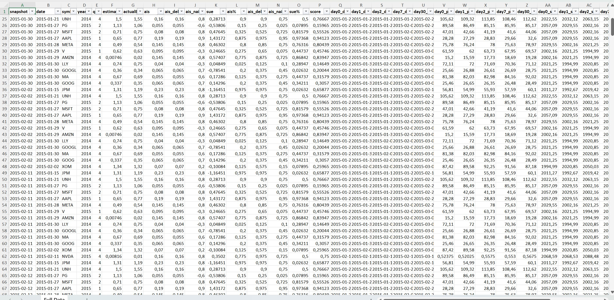

# Documentation

The workflow consists of 5 main steps:

* **1.) Download** - Download metadata, transcripts and prices 
    * 1.1.) Get Tickers
    * 1.2.) Get Dates
    * 1.3.) Get EPS
    * 1.4.) Get Transcripts 
    * 1.5.) Get Prices
* **2.) Score** - Score Transcripts and calculate Unexpected Earnings
    * 2.1.) Summarize Transcript
    * 2.2.) Score Summarized Transcript
    * 2.3.) Calculate SUE 
    * 2.4.) Calculate AIS Delta
* **3.) Group** - Group by date using latest earnings call result from every stock
* **4.) Export** - Export into intermediate format for further analysis
    * 4.1.) Snapshot JSON file
    * 4.2.) Earnings Data Excel File
* **5.) Aanalyse** - Calculate and Analyse Data
    * 5.1.) Analyse Snapshots JSON file
    * 5.2.) Simulate Trading Strategy


# 1. Download

Download Stock Metadata, Transcripts and Prices from Financial Modeling Prep, e.g. Earnings Transcript API.

## 1.1. Get Tickers
* Get S&P 500 Ticker Symbols 
* [S&P 500 Consituents API](https://site.financialmodelingprep.com/developer/docs#sp-500-constituents)

```
GET https://financialmodelingprep.com/api/v3/sp500_constituent?apikey=xxxxxxxxxxxxxxxxxxxxxxxxxxxxxxxx
[
  {
    "symbol": "APO",
    "name": "Apollo Global Management",
    "sector": "Financial Services",
    "subSector": "Asset Management - Global",
    "headQuarter": "New York City, New York",
    "dateFirstAdded": "2024-12-23",
    "cik": "0001858681",
    "founded": "1990"
  },
  ...
]
```

## 1.2. Get Dates
* Get Earnings Call Dates - quarter, year, date
* [Transcript Dates API](https://site.financialmodelingprep.com/developer/docs#transcript-dates-earnings-transcripts)

```
GET https://financialmodelingprep.com/api/v4/earning_call_transcript?symbol=AAPL&apikey=xxxxxxxxxxxxxxxxxxxxxxxxxxxxxxxx
[
  [
    4,
    2024,
    "2024-10-31 17:00:00"
  ],
  ...
]
```


## 1.3. Get EPS
* Get Earnings Per Share (EPS) - actual, estimated, historical 
* [Earnings Surprises API](https://site.financialmodelingprep.com/developer/docs#earnings-surprises-earnings)

```
GET https://financialmodelingprep.com/api/v3/earnings-surprises/APO?apikey=xxxxxxxxxxxxxxxxxxxxxxxxxxxxxxxx
[
  {
    "date": "2025-02-04",
    "symbol": "APO",
    "actualEarningResult": 2.22,
    "estimatedEarning": 1.92
  },
  ...
]
```

## 1.4. Get Transcripts
* Get Earnings Calls Transcripts 
* [Earnings Transcript API](https://site.financialmodelingprep.com/developer/docs#earnings-transcript-earnings-transcripts)
```
GET https://financialmodelingprep.com/api/v3/earning_call_transcript/AAPL?year=2020&quarter=3&apikey=xxxxxxxxxxxxxxxxxxxxxxxxxxxxxxxx
[
  {
    "symbol": "AAPL",
    "quarter": 3,
    "year": 2020,
    "date": "2020-07-30 17:00:00",
    "content": "Operator: Good day, everyone. Welcome to the Apple Incorporated Third Quarter Fiscal Year 2020 Earnings Conference Call. Today's call is being recorded. At this time, for opening remarks and introductions, I would like to turn things over to Mr. Tejas Gala, Senior Manager,..."
  },
  ...
]
```

## 1.5. Get Prices
* Find Dates and Prices around Earnings Call Date - day 1, day 7, day 30 
* [Daily Chart EOD API](https://site.financialmodelingprep.com/developer/docs#daily-chart-charts)

```
GET https://financialmodelingprep.com/api/v3/historical-price-full/AAPL?from=2020-10-29&to=2020-12-30&apikey=xxxxxxxxxxxxxxxxxxxxxxxxxxxxxxxx
{
  "symbol": "AAPL",
  "historical": [
    {
      "date": "2020-12-30",
      "open": 135.58,
      "high": 135.99,
      "low": 133.4,
      "close": 133.72,
      "adjClose": 130.62,
      "volume": 96452124,
      "unadjustedVolume": 96452124,
      "change": -1.86,
      "changePercent": -1.37,
      "vwap": 134.6725,
      "label": "December 30, 20",
      "changeOverTime": -0.0137
    },
    ...
  ]
}
```


# 2. Score

Use ChatGPT prompts to summarize earnings calls transcripts and extract the AIS and calculate ΔAIS and SUE to form the composite score.

## 2.1. Summarize Transcript
* (extracts most important information, creates common format)

### 2.1.1 Example Earnings Call Transcript (reducted)
```
Operator: Good morning, and welcome to PepsiCo's 2024 Third Quarter Earnings Question-and-Answer Session. Your lines have been placed on listen-only until it is your turn to ask the question. Today's call is being recorded and will be archived at www.pepsico.com. It is now my pleasure to introduce Mr. Ravi Pamnani, Senior Vice President of Investor Relations. Mr. Pamnani may begin.

Ravi Pamnani: Thank you, Kevin. And good morning, everyone. I hope everyone has had a chance this morning to review our press release and prepared remarks, both of which are available on our website. ...

Operator: Thank you. [Operator Instructions] Our first question comes from Lauren Lieberman with Barclays. Your line is open.

Lauren Lieberman: Thanks. Good morning, everyone. So in the release clear that Frito volumes trended in the right direction in the third quarter, category backdrop is still tough, and you offered a lot of detail in the prepared remarks and kind of the strategy from here. I wanted to maybe think about the building blocks to a return to volume growth for that business? ...

Ramon Laguarta: Good morning, Lauren. Thank you. Let me step back for a minute. If we think about the long-term growth potential of the food business in the U.S., we are very positive about the long-term trends. We've seen Gen Z snacking patterns and food patterns being in a way that favors the growth of our category. They are snacking more. ...
```


### 2.1.2 ChatGPT system message to summarize earnings call transcript:
```
You are a financial analyst that summarizes earning call transcripts with the following instructions:

Please create a clear, concise summary that follows a structured format with two distinct sections: 'Presentation' and 'Discussion.'

In the 'Presentation' section, consolidate the main points made by each member of the management team into a few bullet points. Focus on the key financial figures, company performance indicators, strategic updates, and forward-looking statements.

...

```

### 2.1.3 Example ChatGPT Response to summarize Earnings Call Transcript
```
### Presentation

**Ravi Pamnani (SVP of Investor Relations):**
- Highlighted the availability of the press release and prepared remarks on PepsiCo's website.
- ...

**Ramon Laguarta (Chairman and CEO):**
- Expressed optimism about the long-term growth potential of the U.S. food business, citing favorable snacking trends among Gen Z.
- ...

**Jamie Caulfield (CFO):**
- Highlighted PepsiCo's ability to deliver at the high end of its long-term EPS target despite a challenging consumer environment.
- ...

---

### Discussion

**1. Question (Lauren Lieberman, Barclays):**  
What are the building blocks for a return to volume growth in Frito-Lay, particularly across core Lays, multicultural/value offerings, and premium segments?  
**Answer:**  
Ramon Laguarta emphasized long-term growth trends in snacking, driven by Gen Z's preference for mini meals. He outlined a multi-tier strategy for Lays, including unsalted, lightly salted, baked, and premium options like Miss Vickie's. Investments in innovation, brand programs, and creating new consumption occasions will drive sustainable growth.

...

---

### Peculiar Word Choices or Sentiment Indicators:
- \"Normalization\" was frequently used to describe the current phase for Frito-Lay, indicating a shift from outsized growth to a more stable trajectory.
- \"Optionality\" was emphasized in the context of productivity programs, reflecting management's focus on flexibility to navigate economic challenges.
- \"Mini meals\" and \"permissible\" were highlighted as key growth drivers, signaling a strategic pivot toward evolving consumer trends.

```


## 2.2. Score Summarized Transcript
* score summarized transcript based on 20 categories

### 2.2.1. ChatGPT system message to score a summarized earnings call:
```
## Analyst Insight Score (AIS)

Scores are value ranges from -1 to +1 with the magnitude of the score representing the strength of the perceived impact on the firm. Hence, lower scores (e.g.,-0.7) reflect a strong negative impact, scores close to +1 reflect a strong positive impact and scores close to 0 reflect no expected impact. 

{
    "Growth Potential": {
        "Market and Geographic Expansion": [
            "Market Expansion",
            "Geographic Expansion",
            "International Market Expansion",
            "Expansion into New Markets",
            "Global Market Penetration"
        ],
        ...
    },
    ...
}

---

You are a financial analyst. Analyze the provided summary of an earnings call transcript and score it based on the provided criteria and subcriteria. Respond in the following JSON format:

{  
    "Growth Potential": {
        "Market and Geographic Expansion": {
            "Score": 0.0,
            "Rationale": ""
        },
        "Product and Service Development": {
            "Score": 0.0,
            "Rationale": ""
        },
        "Mergers, Acquisitions, and Partnerships": {
            "Score": 0.0,
            "Rationale": ""
        },
        "Digital Transformation and E-commerce": {
            "Score": 0.0,
            "Rationale": ""
        },
        "Operational Efficiency and Diversification": {
            "Score": 0.0,
            "Rationale": ""
        }
    }
    "Earnings Quality": {
        ...
    }
    ...
}
```


### 2.2.2. Example ChatGPT Response for Score
```
{
    "Growth Potential": {
        "Market and Geographic Expansion": {
            "Score": 0.7,
            "Rationale": "Apple reported strong growth in Europe (+11% YoY) and emerging markets like India, Turkey, and the Middle East. This reflects successful geographic expansion, particularly in regions with high growth potential."
        },
        "Product and Service Development": {
            "Score": 0.8,
            "Rationale": "The launch of Apple Intelligence, a generative AI system, and the continued expansion of Apple Vision Pro with over 2,500 native spatial apps highlight significant product innovation. Additionally, Services revenue reached an all-time high, driven by recurring revenue growth."
        },
        "Mergers, Acquisitions, and Partnerships": {
            "Score": 0.0,
            "Rationale": "No notable mentions of mergers, acquisitions, or partnerships in the earnings call."
        },
        "Digital Transformation and E-commerce": {
            ...
        },
        "Operational Efficiency and Diversification": {
            ...
        }
    },
    "Earnings Quality": {
        ...
    },
    "Quality of Management": {
        ...
    },
    "Risk": {
        ...
    }
}


```

## 2.3. Calculate SUE
* SUE: Standard Unexpected Earnings
* What is SUE? (describe)
* Formula for Standard Deviation: 
* Formula for SUE: actual EPS, estimated EPS and historical EPS


```csharp
float estimatedEarning = 2.36;
float actualEarningResult = 2.4;
var historical_eps = [ 1.64, 1.4, 1.53, 2.18, 1.46, 1.26, 1.52, 1.88 ];

# Calculate Standard Deviation
var avg = values.Average();
var sumOfSquaresOfDifferences = values.Select(val => (val - avg) * (val - avg)).Sum();
var variance = sumOfSquaresOfDifferences / values.Count;
var stdDev = (decimal)Math.Sqrt((double)variance);

# Calculate Standardized Unexpected Earnings (SUE)
var sue = (actualEarning - estimatedEarning) / stdDev

```

## 2.4. Calculate AIS Delta

```csharp
var delta = ais - prevAis;
```


# 3. Group

Group data into snapshots and export all snapshots as one big JSON file for later analysis. (A snapshot is a collection of earnings calls results of all stocks at a given point in time. We create a snapshot for every date where an earnings call happened for any of the 500 companies.)

Description:
* for every earnings call date get the latest earnings call result for every stock (snapshot)
* having the latest earnings calls for each date allows us to compare all stocks
* the draw back is that the latest earnings call date may be over three months old, e.g. see snapshot.json example:

The snapshot.json example file shows two dates "2015-08-12" and "2015-08-13" with each earnings call date (snapshot) containing the latest earnings calls results for tickers "A", "AAL", "AAP". Notice how for "AAP" on "2015-08-12" the latest earnings call date is the "2015-05-21" (almost three months back) and on "2015-08-13" the latest earnings call date for "AAP" is the "2015-08-13".

```json
{
    "2015-08-12": [
        {
            "date": "2015-05-19",
            "symbol": "A",
        ...
        },
        {
            "date": "2015-07-27",
            "symbol": "AAL",
        ...
        },
        {
            "date": "2015-05-21",
            "symbol": "AAP",
        ...
        }
    ],
    "2015-08-13": [
        {
            "date": "2015-05-19",
            "symbol": "A",
        ...
        },
        {
            "date": "2015-07-27",
            "symbol": "AAL",
        ...
        },
        {
            "date": "2015-08-13",
            "symbol": "AAP",
            "year": 2015,
            "quarter": 2,
            "ais": 0.1,
            "ais_delta": 0.01,
            "ais_naive": 0.4,
            "sue": 0.0387647905339773471420861572,
            "ais%": 0.416496945010183,
            "ais_delta%": 0.54786150712831,
            "ais_naive%": 0.165987780040733,
            "sue%": 0.29874213836478,
            "estimatedEarning": 2.25,
            "actualEarningResult": 2.27,
            "score": 0.4210335301677576666666666667,
            "day0_date": "2015-08-12",
            "day1_date": "2015-08-13",
            "day2_date": "2015-08-14",
            "day7_date": "2015-08-20",
            "day30_date": "2015-09-14",
            "day0_price": 172.0,
            "day1_price": 187.79,
            "day2_price": 187.03,
            "day7_price": 184.45,
            "day30_price": 175.0,
            "day0_sp500_price": 2086.05,
            "day1_sp500_price": 2083.39,
            "day2_sp500_price": 2091.54,
            "day7_sp500_price": 2035.73,
            "day30_sp500_price": 1953.03
        },
      ...
    ],
    ...
}
```

# 4. Export

Export all snapshots as one big JSON file for later analysis. (A snapshot is a collection of earnings calls results of all stocks at a given point in time. We create a snapshot for every date where an earnings call happened for any of the 500 companies.)

## 4.1. Snapshot JSON file

Format of the snapshot.json file:
```json
{
    "2015-08-12": [
        {
            "date": "2015-05-19",
            "symbol": "A",
        ...
        },
        {
            "date": "2015-07-27",
            "symbol": "AAL",
        ...
        },
        {
            "date": "2015-05-21",
            "symbol": "AAP",
        ...
        }
    ],
    "2015-08-13": [
        {
            "date": "2015-05-19",
            "symbol": "A",
        ...
        },
        {
            "date": "2015-07-27",
            "symbol": "AAL",
        ...
        },
        {
            "date": "2015-08-13",
            "symbol": "AAP",
            "year": 2015,
            "quarter": 2,
            "ais": 0.1,
            "ais_delta": 0.01,
            "ais_naive": 0.4,
            "sue": 0.0387647905339773471420861572,
            "ais%": 0.416496945010183,
            "ais_delta%": 0.54786150712831,
            "ais_naive%": 0.165987780040733,
            "sue%": 0.29874213836478,
            "estimatedEarning": 2.25,
            "actualEarningResult": 2.27,
            "score": 0.4210335301677576666666666667,
            "day0_date": "2015-08-12",
            "day1_date": "2015-08-13",
            "day2_date": "2015-08-14",
            "day7_date": "2015-08-20",
            "day30_date": "2015-09-14",
            "day0_price": 172.0,
            "day1_price": 187.79,
            "day2_price": 187.03,
            "day7_price": 184.45,
            "day30_price": 175.0,
            "day0_sp500_price": 2086.05,
            "day1_sp500_price": 2083.39,
            "day2_sp500_price": 2091.54,
            "day7_sp500_price": 2035.73,
            "day30_sp500_price": 1953.03
        },
      ...
    ],
    ...
}
```
[snapshot.json](2015-08-14-example-history/snapshots.json)


## 4.2. Earnings Data Excel File

Write Earnings Data Excel File: earnings-data-history.xlsx or earnings-data-latest.xlsx depending on configuration in Appsettings.json (e.g. "ONLY_LATEST": true)

Depending on the configuration a different file excel file will be exported:

1. History: earnings-data-history.xlsx: 
* Appsettings.json ("ONLY_LATEST": false)
* [earnings-data-history.xlsx](2015-08-14-example-history/earnings-data-history.xlsx)


2. Latest: earnings-data-latest.xlsx
* Appsettings.json ("ONLY_LATEST": false)
* [earnings-data-latest.xlsx](2015-08-14-example-latest/earnings-data-latest.xlsx)


# 5. Aanalyse

Analyse Data and Simulate Trading Strategy using Snapshots JSON file.

## 5.1. Analyse Snapshots JSON file

* group data into quantiles (split data into 10 buckets or percentiles, e.g. 10%, 20%, 30%,...)
* calculate average returns based on score in each quantile

Analysis:
* Quantile Analysis
* Regression Analysis

```python
#
# 1. Load Data
#

data = []
with open(snapshot_file, 'r') as f:
	snapshots = json.load(f)
	for date in snapshots.keys():
		data.append(snapshots[date])

#
# 2. Add Data
#

# Create data container
df = pd.DataFrame(data)

# calculate returns
df['return_day2'] = df.apply(lambda row: calculate_return(row, 'day1_price', 'day2_price'), axis=1)
df['return_day7'] = df.apply(lambda row: calculate_return(row, 'day1_price', 'day7_price'), axis=1)
df['return_day30'] = df.apply(lambda row: calculate_return(row, 'day1_price', 'day30_price'), axis=1)

#
# 3. Quantile Analysis
#

df['quantile'] = pd.qcut(df["score"], q=10, labels=False, duplicates='drop') # Divide into 10 quantiles
analysis = df.groupby('quantile')[['return_day2', 'return_day7', 'return_day30']].mean()
print(analysis)


#
# 4. Regression Analysis
#

# Define independent and dependent variables
X = df["score"]
y = df['return_day30']

# Add a constant to the independent variable (for intercept)
X = sm.add_constant(X)

# Perform OLS regression
model = sm.OLS(y, X, missing='drop').fit() # Drop rows with NaN

# Print regression results
summary = model.summary()
print(summary)

```

quantile-analysis-normal-returns.png:
```
          return_day2  return_day7  return_day30
quantile
0.0         -0.004252    -0.003259      0.004986
1.0         -0.003074    -0.000209      0.013372
2.0         -0.002194    -0.001691      0.006396
3.0         -0.001574    -0.000936      0.013299
4.0          0.001623     0.004080      0.013301
5.0          0.001684     0.004404      0.014655
6.0          0.003558     0.007586      0.017249
7.0          0.003519     0.008020      0.016866
8.0          0.005052     0.007749      0.016698
9.0          0.007972     0.010623      0.023296
```


## 5.2. Simulate Trading Strategy

Description: simulate trading strategy (automated) and create report (manual)

Strategy: on each earnings call date: 1. sell stocks no longer in top, 2. buy new stocks in top

pseudo code: 
```python
# Track portfolio of top stocks
portfolio = {}

# Load the Snapshots JSON data
with open(snapshot_file, 'r') as f:
    snapshots = json.load(f)

# Process each snapshot
for date, stocks in sorted(snapshots.items()):

    # Select top stocks with highest score
    top_stock_symbols = select_top_stocks_with_highest_score(stocks, number_of_top_stocks)
    
    # Sell stocks no longer in top
    for symbol in list(portfolio.keys()):
        if symbol not in top_stock_symbols:
            ...
            transactions.append({ 'Date': date, 'Action': 'Sell', 'Symbol': symbol, 'Quantity': quantity, 'Price': price, 'Amount': sell_amount })
            del portfolio[symbol]

    # Buy new stocks
    new_stocks = [stock for stock in top_stocks if stock['symbol'] not in portfolio]
    for stock in new_stocks:
        ...
        transactions.append({ 'Date': date, 'Action': 'Buy', 'Symbol': stock['symbol'], 'Quantity': quantity, 'Price': price, 'Amount': buy_amount })
        portfolio[stock['symbol']] = quantity

# Export to Excel
df = pd.DataFrame(transactions)
df.to_excel('analyst-trading-transactions.xlsx', index=False)
...
```

Results from `get-trading-transactions.py`:
* [analyst-trading-transactions.xlsx](2025-02-22-sp500/analyst-trading-transactions.xlsx)
* [analyst-portfolio-values.xlsx](2025-02-22-sp500/analyst-portfolio-values.xlsx)

Results from `get-sp500-historical-values.py`
* [sp500-historical-values.xlsx](2025-02-22-sp500/sp500-historical-values.xlsx)

Manually Combining all Results into one Excel file and build Charts:
* [analyst-vs-sp500-performance.xlsx](2025-02-22-sp500/analyst-vs-sp500-performance.xlsx)


# More Information

APIs used
* Financial Modeling Prep (FMP) [link](https://site.financialmodelingprep.com/developer/docs#earnings-transcript-earnings-transcripts)
* Azure OpenAI API


