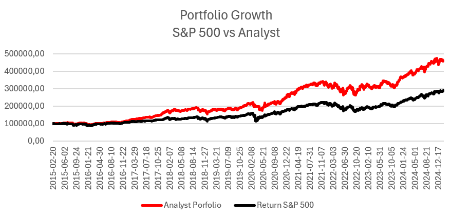
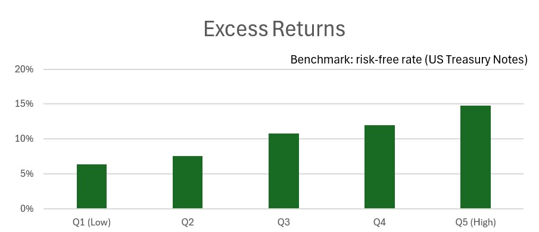
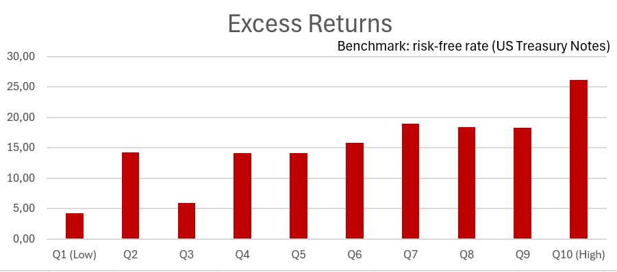
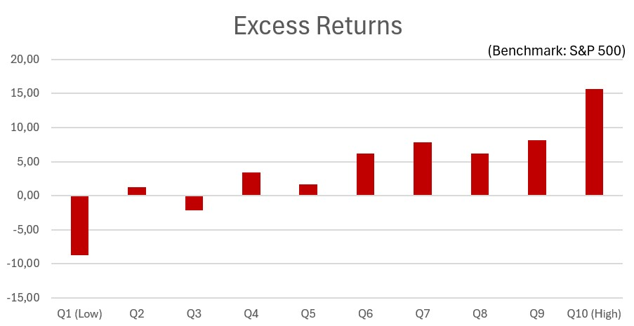
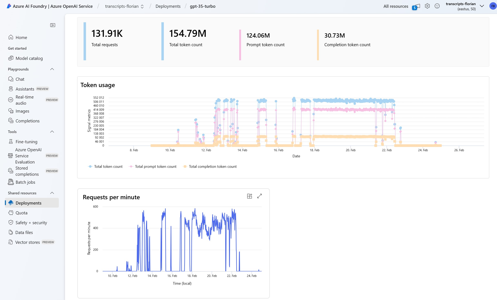
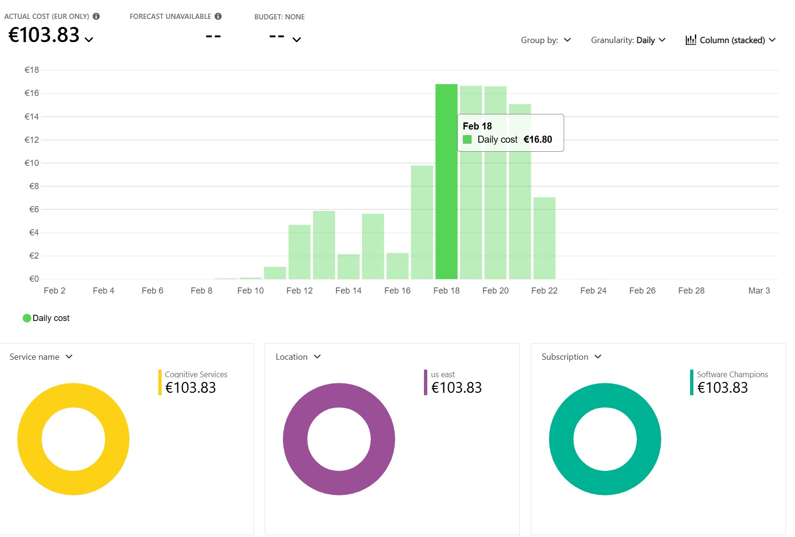

# Use AI to Predict Stock Performance and Outperform the S&P 500 by 5% Annually

I found out that I can beat the S&P 500 by 5% annually using ChatGPT.



[Chart showing Portfolio Growth: S&P 500 vs AI-Analyst.]

I tested this by investing into the top 40 stocks of the S&P 500, using ChatGPT to analyse earnings calls transcripts and calculate sentiment scores. 

| The top 40 stocks with the highest score would grow my portfolio in the last decade by a 4.5 fold - from 100k to 445k. Compared to the S&P 500 which only grew by a 2.8 fold - from 100k to 281k.


# Original Study

According to a [research paper from the University of Sydney](https://papers.ssrn.com/sol3/papers.cfm?abstract_id=4819470), investors can achieve abnormal returns of 8.4% p.a. (70 basis points per month), by using a strategy that combines the Analyst Insight Score (AIS) and Standardized Unexpected Earnings (SUE).

To test this, the researchers created portfolios based on the AIS score of the 200 largest stocks in the US. Every month, they sorted the 200 stocks into five buckets of 40 stocks based on the AIS score in the previous month. Then they repeated the exercise every month between 2015 and 2024.



[Chart shows Excess Returns of five quintiles with risk-free rate as benchmark; yearly returns.]

The research shows that the qualitative information captured by ChatGPT helps to create performance.

*(Note: Excess returns are defined as the average monthly returns minus the risk-free rate for the same period. For the risk-free rate I assume the researchers used US Treasury Bonds. The results are shown without transaction costs.)*


# Results Based on my Implementation
Inspired by the original research paper, I used GPT-3.5 to analyze all earning calls transcripts of the 500 largest stocks in the US over a 10 year period. I published my source code on GitHub. 

Every time a new earnings call was published I calculated the AIS, ∆AIS and SUE as a percentage over all stocks and took the average of those three values to form the overall score.

Based on the score I sorted the stocks into 10 buckets (quintiles) and performed a statistical analysis by looking at the stock performance 30 days after the earnings call.



[Chart shows Excess Returns of ten quintiles with risk-free rate as benchmark; yearly returns.]

The chart shows that higher-scoring quintiles have significantly higher potential to outperform lower-scoring quintiles. 

**Q10 has a monthly performance of 2.18% with risk-free rate as benchmark -  26.18% p.a.**



[Chart shows Excess Returns of ten quintiles with S&P 500 as benchmark; yearly returns.]

**Q10 has a monthly performance of 1.33% with S&P-500 as benchmark -  15.6% p.a.**


# Introduction


[https://florianboehmak.com/]

Reading about a research paper that promised abnormal returns, my friend Daniel asked me if I could help him out to implement an AI driven investment strategy.

As a [passionate software engineer](https://florianboehmak.com/) I found this project an exciting opportunity to follow my interest in AI and AI-driven financial analysis. So I put my mind to it to see if we can replicate these abnormal returns…

| The goals of the case study was to replicate and potentially improve upon analyst recommendations using ChatGPT.


# The Challenge

* Explore the research paper and have a flexible code structure that allows me to adjust based on new insights.
* Handle API rate limits and caching for better performance.
* Finding an affordable API provider to access earnings calls transcripts (subscription prices range from $588 to $25000 per year).
* Analyzing 500 stocks over a 10 year period takes round 120 hours (5 days) to complete.

# My Approach

The research paper offers multiple formulas with abnormal returns and I focused on the one with the highest return: Score = AIS + AIS_Delta + SUE.

My main tools to help me better understand the research paper and to implement the software in Python and C# were:
* Perplexity AI 
* Cursor - The AI Code Editor

# Implementation Details

1. Data Collection:
Download Stock Metadata, Transcripts and Prices from Financial Modeling Prep, e.g. Earnings Transcript API

2. Processing and Scoring:
Use ChatGPT prompts to summarize earnings calls transcripts and extract the AIS and calculate ΔAIS and SUE to form the composite score.

3. Data Grouping and Exporting:
Group data into snapshots and export all snapshots as one big JSON file for later analysis. (A snapshot is a collection of earnings calls results of all stocks at a given point in time. We create a snapshot for every date where an earnings call happened for any of the 500 companies.)

4. Quantitative Analysis and Strategy Testing:
Validate the stock performance by analyzing quantile-based returns and simulate practical investment strategies.


[Simulation of an Investment Strategy (buy/sell top 40 stocks with the highest score).]

# Results

The detailed analysis showed that stocks with higher ratings performed exceptionally well, earning more money compared to both their normal returns and the broader market benchmark, the S&P 500.

* **`2.36%` return after 30 days (no benchmark) => `28.4% p.a.`**
* **`1.33%` excess return after 30 days (S&P 500 as benchmark) => `15.6% p.a.`**

## Quantile Analysis with Normal Returns:

The Quantile Analysis is performed on the dataset by:
* putting data into 10 quintiles based on "score"
* calculating the average for each given column in each quantile


[Monthly excess returns for days after the earnings call (day2, day7, day30).]

```
quantile    excess_day2  excess_day7   excess_day30

0.0         -0.004920    -0.005930     -0.007329
1.0         -0.003478    -0.002807      0.001034
2.0         -0.002609    -0.003537     -0.001818
3.0         -0.001842    -0.003764      0.002848
4.0          0.001055     0.001002      0.001408
5.0          0.001280     0.001642      0.005185
6.0          0.002990     0.004406      0.006496
7.0          0.002956     0.004300      0.005122
8.0          0.004426     0.004840      0.006800
9.0          0.007239     0.007788      0.013077
```

The highest quintile has an excess return of 1.33% per month whereas the lowest quintile has an excess return of -0.73% per month.

```
                            OLS Regression Results
==============================================================================
Dep. Variable:           excess_day30   R-squared:                       0.003
Model:                            OLS   Adj. R-squared:                  0.003
Method:                 Least Squares   F-statistic:                     3067.
Date:                Tue, 25 Feb 2025   Prob (F-statistic):               0.00
Time:                        12:47:40   Log-Likelihood:             1.0167e+06
No. Observations:              982909   AIC:                        -2.033e+06
Df Residuals:                  982907   BIC:                        -2.033e+06
Df Model:                           1
Covariance Type:            nonrobust
==============================================================================
                 coef    std err          t      P>|t|      [0.025      0.975]
------------------------------------------------------------------------------
const         -0.0085      0.000    -37.050      0.000      -0.009      -0.008
score          0.0236      0.000     55.383      0.000       0.023       0.024
==============================================================================
Omnibus:                   301279.518   Durbin-Watson:                   1.944
Prob(Omnibus):                  0.000   Jarque-Bera (JB):          8043510.430
Skew:                           0.899   Prob(JB):                         0.00
Kurtosis:                      16.899   Cond. No.                         6.19
==============================================================================
```

The Regression Analysis provides an interesting statistical insight into the relationship between a sentiment analysis composite score:

* **Quantitative Insight:** The positive coefficient for ‘score’ suggests a strong supportive evidence that higher sentiment scores (perhaps indicating more positive outlooks in earnings calls) correlate positively with higher excess returns over a 30-day period post-earnings announcement.
* **Model Limitations:** Despite statistical significance, the extremely low R-squared value questions the practical significance of the model. It implies that the sentiment score, while informative, explains a very small fraction of the variation in excess returns. This highlights that many other factors (unaccounted for in the model) likely influence stock returns.
* **Strategic Use:** Investors might use this model to enhance their decision-making process by factoring in sentiment analysis, albeit with an understanding of its limited explanatory power. It suggests evaluating other variables (like macroeconomic indicators, other financial ratios, etc.) alongside sentiment scores.


# Fun Facts

Predicting stock performance with ChatGPT required both time and financial investment. Here are some interesting details:

- stocks analyzed: **542**
- earnings calls analyzed: **20k**
- time it took to run: **120 hours (5 days)**
- ChatGPT cost: **100 EUR**
- financial API cost: **67 EUR**



[Azure OpenAI usage with rate limits.]




# Personal and Project Reflection

By analyzing earnings call transcripts of the top 40 S&P 500 stocks using ChatGPT, my portfolio achieved a significant growth, outperforming the S&P 500 over a decade by 5% annually.

Some challenges included managing large datasets, handling API rate limits, accessing cost-effective data sources for earnings transcripts, and maintaining a flexible code structure to adjust while learning and analyzing data.

Potential Improvements:

* **Market Entry:** Timing stock purchases immediately post-earnings could potentially capitalize on market reactions.
* **AI Model Upgrade:** Considering more advanced AI models could refine insights and predictions.
* **Prompt Engineering:** Improving the prompts used for AI analysis might enhance the quality of data interpretation.
* **Investment Strategy Adjustments:** Exploring different portfolio sizes and incorporating trading costs into the strategy.

Looking forward, the next steps involve setting up automated trading systems and experimenting with different portfolio strategies to further refine the investment process and handle associated costs more effectively.

# Source Code

You can find the source code on my GitHub page here.

# Disclaimer

This is a personal project and should not be taken as professional investment advice. Always conduct your own research or consult with a financial advisor.

-----------------------------------------------------------

source:
- Research Paper: [Can ChatGPT Replicate Analyst Recommendations](https://papers.ssrn.com/sol3/papers.cfm?abstract_id=4819470)
- Joachim Klement: [ChatGPT can predict analyst forecast changes](https://klementoninvesting.substack.com/p/chatgpt-can-predict-analyst-forecast)